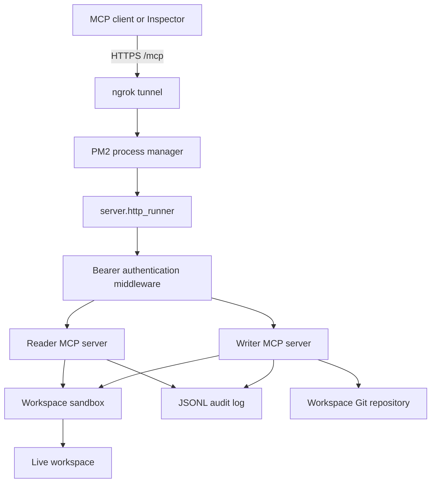

# Architecture

## Runtime flow

`server.http_runner` loads settings, builds two role-specific MCP server
instances, and serves both under `/mcp`. `AuthenticationMiddleware` verifies
the bearer token and routes the request to the reader or writer instance. The
MCP SDK handles Streamable HTTP sessions; the application owns role selection,
path safety, tool registration, and audit records.

## Tool surface

| Role   | Tools                                                                               |
| ------ | ----------------------------------------------------------------------------------- |
| Reader | `list_files`, `read_file`, `search_files`, `append_state`, `git_status`, `git_diff` |
| Writer | All reader tools plus `write_file`, `str_replace`, `delete_file`, `git_commit`      |

The live workspace is external to the server repository. This keeps application
code, credentials, logs, and workspace content separate while allowing the
workspace itself to have its own Git history.
