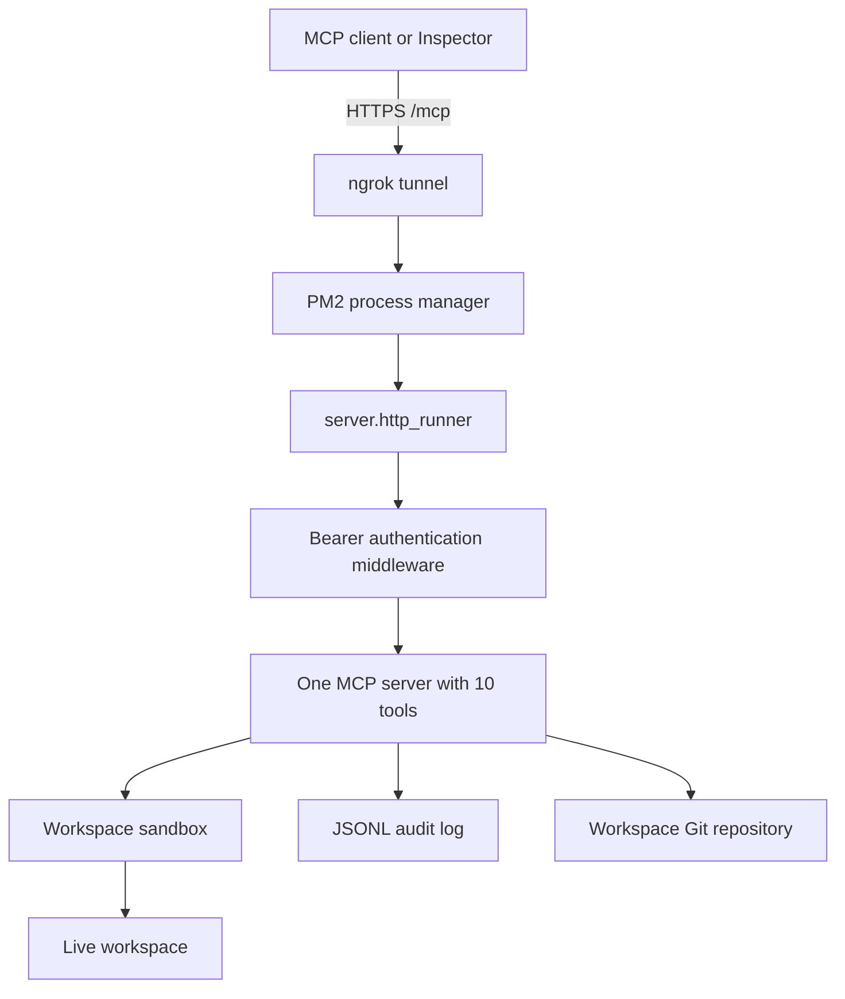

# Architecture

## Runtime flow

`server.http_runner` loads settings, builds one MCP server, and serves it under
`/mcp`. `AuthenticationMiddleware` verifies the single bearer token before
forwarding requests. The MCP SDK handles Streamable HTTP sessions; the
application owns path safety, tool registration, and audit records.

## Tool surface

| Authenticated MCP client | Tools                  |
| ------------------------ | ---------------------- |
| `MCP_TOKEN`              | All 10 workspace tools |

The live workspace is external to the server repository. This keeps application
code, credentials, logs, and workspace content separate while allowing the
workspace itself to have its own Git history.
